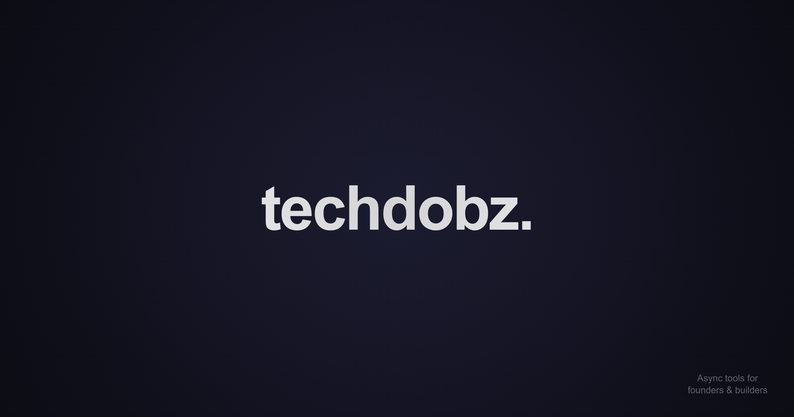

# 👋 Hey, I’m Techdobz — Quietly Building Tools, Systems & Ideas

I’m an engineer, writer, and builder focused on **backend-first systems**, automation, and clean internal tools.  
But **Techdobz** isn’t just services — it’s a space for sharing **quiet software, thought loops, and experiments** around building, learning, and simplifying things.

> Fast builds. Local-first thinking. Async workflows. Clarity over clutter.

---

## 💼 What I Build

- ⚙️ **Custom Backends** — APIs, Django apps, logic layers  
- 🤖 **Automation & Scrapers** — bots, webhooks, smart triggers  
- 📊 **Dashboards & CRMs** — tools to track, filter, and ship internally  
- 🔐 **Local-First Systems** — encrypted apps, offline-first tools  
- 🧹 **One-Off Scripts** — CLI tools, schedulers, API wrappers

> I like things that just work — and keep working.

---

## 🧠 What Techdobz Covers

- 🛠 Tools & product experiments  
- 🧬 Systems thinking & backend clarity  
- 🧘 Self-improvement & learning workflows  
- 📓 Walkthroughs, breakdowns, blog posts  
- 🔐 Privacy-first, zero-trust design

A mix of tech, thinking, and tinkering — less noise, more utility.

---

## ✉️ Work With Me

If you're a solo founder, ops-heavy team, or just wrestling with backend chaos — I help turn vague ideas into working systems.

- Small builds, fast turnaround  
- Backend logic with minimal UI  
- Fully async, no hand-holding needed  

📩 [techdobz.com](https://techdobz.com)  
☕ [ko-fi.com/techdobz](https://ko-fi.com/techdobz)

---

## 🔐 Featured Tool: [Zero](https://techdobz.com/apps/zero)

A fully offline, encrypted vault app to store sensitive or structured data — passwords, OTPs, private notes, metadata, and more.

- ✅ 100% local-first — no accounts, no cloud  
- 🔐 Encrypted by default (zero-trust design)  
- 🧠 Structured, schema-aware, searchable  
- 💻 Available for **Linux** and **Windows** — macOS soon

📘 [Docs](https://techdobz.com/docs)  
📦 [Download](https://techdobz.com/apps/zero/download)  
📂 [GitHub Issues](https://github.com/techdobz/zero-app)  
☕ [Support](https://ko-fi.com/techdobz)

---

## 📰 Elsewhere

- 📚 [Blog](https://techdobz.com/blog) — notes, mental models, backend stuff  
- 🧰 [Projects](https://techdobz.com/#work) — tools, dashboards, quiet builds  
- 📘 [Docs](https://techdobz.com/docs) — setups, usage, walkthroughs  

---

## 🌱 How I Think

- Minimal UIs, strong internals  
- Quiet tools > bloated stacks  
- Local-first, encrypted-by-default  
- Clarity beats cleverness  
- Systems that stay out of your way

---

## 🔗 Find Me Elsewhere

- 🐦 [Twitter / X](https://x.com/techdobz) — updates, thoughts, & builds    
- 🧑‍💻 [GitHub](https://github.com/techdobz) — code & projects  
- 📷 [Instagram](https://instagram.com/tech_dobz) — behind the scenes  
- ☕ [Ko-fi](https://ko-fi.com/techdobz) — support & side drops  
- 🗨️ [Reddit](https://reddit.com/u/techdobz) — occasional deep dives  
- 🌐 [techdobz.com](https://techdobz.com) — blog, tools, services

---

Thanks for visiting.  
If something here clicks — feel free to reach out, follow, or just borrow an idea.
